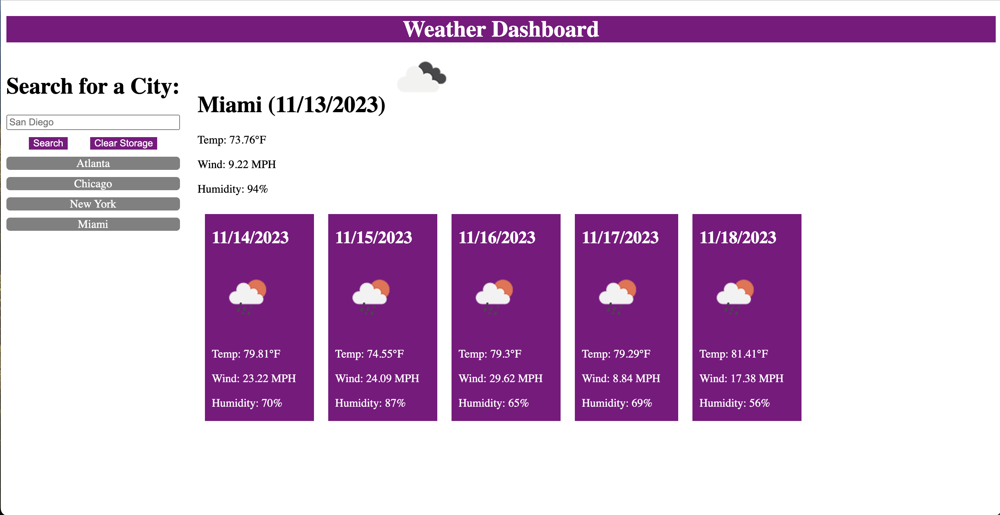

# Weather Dashboard

## Description

In this application I created a weather appilcation using Server Side APIs. The appilcation is a weather dashboard that searches a given city's weather and then posts and stores that city to local storage to search for the weather again. The dashboard displays current weather condtions for the given date, like the current temperature, wind speed, and humidity. It also shows an icon representing the current weather condtions. Under the current weather condtions in the city you can find a five day forecast for the next five days in the city. Each day gives the forecasted temperature, wind speed, and humidity, along with an icon that represents the forecasted condtions.

### Take-Aways

- My motivation for this project was to expand my knowledge of server-side APIs such as fetching JSOn data and presenting it on a webpage.

- The problem my weather dashboard solved was that it helps people find and track the weather in any city.

- I learned about server-side APIs such as OpenWeather.

## Usage

This appilcation is a weather dashboard program.

- You are able to fill search for weather data from any city in the search bar.
    - You can also click on saved cities below the search bar to access them again.
    - Clearing the stored cities is achevied by clicking the clear storage button.

**[Deployed Application](https://kpierce236.github.io/Weather-Dashboard/)**

### Screenshot of Application

## Credits

### Server-Side APIs

- [OpenWeather](https://openweathermap.org/)

### Third-Party Assets

- [jQuery](https://jquery.com/)
- [Day.js](https://day.js.org/en/)

### Tutorials

- [A Guide to Flexbox](https://css-tricks.com/snippets/css/a-guide-to-flexbox/)
- [MDN web docs](https://developer.mozilla.org/en-US/docs/Web/JavaScript)
- [Writing a README](https://coding-boot-camp.github.io/full-stack/github/professional-readme-guide)

## License

Please refer to license in the repo.